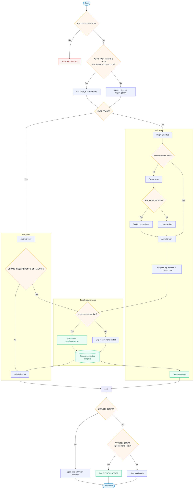
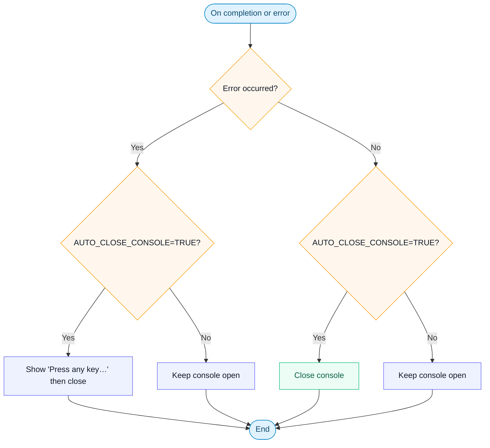

# Python Virtual Environment Launcher (Windows)

A robust Windows batch script that creates, activates, and manages a Python virtual environment
for your project, installs dependencies, and launches your Python application.

## Highlights

* Automatic venv creation and activation
* Smart Fast Start to skip full setup when a valid venv exists
* Optional requirements installation/update
* Colored, readable logs
* Option to hide the venv directory
* Interactive shell mode (when LAUNCH_SCRIPT=FALSE)
* Safe error handling and clear messaging

## Quick Start

1. Put `Start.bat` in your project root.
2. Optionally create `requirements.txt` and your app script (default: `app.py`).
3. Double-click `Start.bat` (or run it from a terminal).

> **Note:**
>
> * `Start.bat` always operates from its own directory (`pushd %~dp0`).
> * The venv is created using `python -m venv` with the Python found in `PATH`.

## Usage Scenarios

* **First run in a new repo:**
  * The script creates the venv, upgrades pip, installs requirements, and runs your script.

* **Subsequent runs with no changes:**
  * With `AUTO_FAST_START=TRUE` (default), it activates the existing venv and runs quickly.
  * Set `UPDATE_REQUIREMENTS_ON_LAUNCH=TRUE` if you want fast start to also check and install requirements each time.

* **Interactive shell only:**
  * Set `LAUNCH_SCRIPT=FALSE` to prepare the venv and drop into an activated interactive shell.

**Example structure:**

```plaintext
your-project/
├── Start.bat
├── app.py
├── requirements.txt
└── .venv/         # auto-created; hidden if enabled
```

## Configuration

| Variable                        | Default            | Description                                            |
| ------------------------------- | ------------------ | ------------------------------------------------------ |
| `PYTHON_SCRIPT`                 | `app.py`           | Script to run after setup.                             |
| `REQUIREMENTS_FILE`             | `requirements.txt` | Requirements file to install from.                     |
| `VENV_DIR`                      | `.venv`            | Virtual environment directory name.                    |
| `FAST_START`                    | `FALSE`            | Forces fast start mode if venv is valid.               |
| `AUTO_FAST_START`               | `TRUE`             | Auto-enables fast start when venv exists and responds. |
| `UPDATE_REQUIREMENTS_ON_LAUNCH` | `FALSE`            | When in fast start, also update requirements.          |
| `AUTO_CLOSE_CONSOLE`            | `TRUE`             | After script completion, close the console.            |
| `LAUNCH_SCRIPT`                 | `TRUE`             | If `TRUE`, launch the Python script after setup; if `FALSE`, open an interactive shell. |
| `SET_VENV_HIDDEN`               | `TRUE`             | Sets venv directory attribute to Hidden.               |
| `ENABLE_COLORS`                 | `TRUE`             | Enables ANSI colors for log messages.                  |
| `QUIET_MODE`                    | `FALSE`            | Reduces pip output verbosity.                          |
| `PIP_TIMEOUT`                   | `30`               | Timeout for pip operations.                            |

---

## How It Works

The flowchart below shows the main execution path.

### Main execution path



### Console behavior


